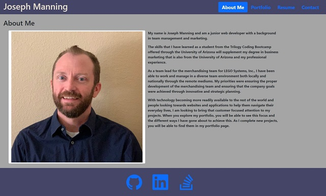
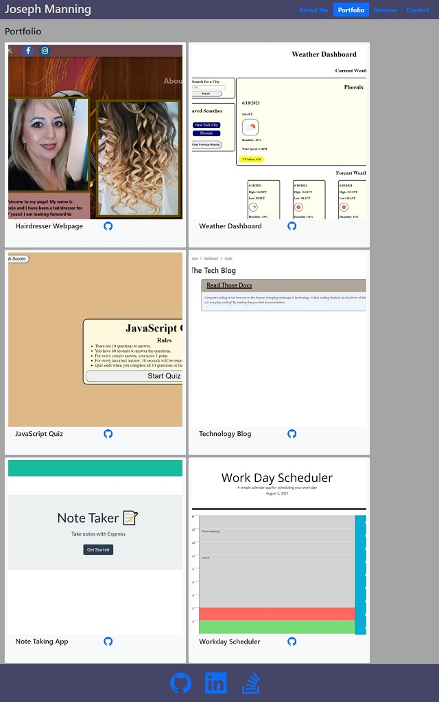
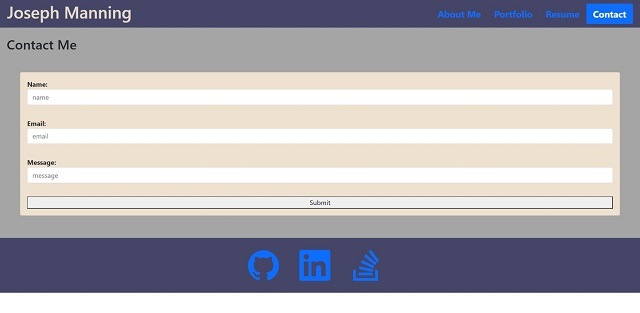

# ReactPortfolio

## Description

As a junior web developer, I would like to be able share all the projects that I have worked on while at the same time show those skills employed at the same time.  With my React portfolio, I am able to showcase my previous work through React.  In my portfolio, whoever visits my site will be able to seamlessly navigate from one page to another without reloading their browser. The views will provide a brief introduction of myself, show my previous work, my resume, and even contact me.

## Table of Contents

- [Usage](#usage)
- [Contributing](#contributing)
- [Testing](#testing)
- [License](#license)
- [Resources](#resources)

## Usage

You can view my React portfolio on the Netlify server at https://dreamy-swanson-c29ee4.netlify.app.

## Contributing

If you are looking to contribute to the project, you can fork the repo from its GitHub page.

You can find the project at https://github.com/JMan4342/ReactPortfolio.

## Testing

Below you will find screenshots of the different views of my React portfolio app, and a link to a video demoing it.

https://drive.google.com/file/d/1F15JvB4YTL4cjuNUIo0G38hYo31hlYlU/view?usp=sharing

## License

MIT

## Resources

I utilized the following sites to assist in creating my React portfolio.

- https://create-react-app.dev/
- https://www.kindacode.com/article/react-typescript-handling-onfocus-and-onblur-events/
- https://www.freecodecamp.org/news/how-to-use-svg-icons-in-react-with-react-icons-and-font-awesome/

## Questions

If you have any questions, I can be reached on my GitHub at [JMan4342](https://github.com/JMan4342).

You can also reach me by email at manning.joseph.4342@gmail.com.